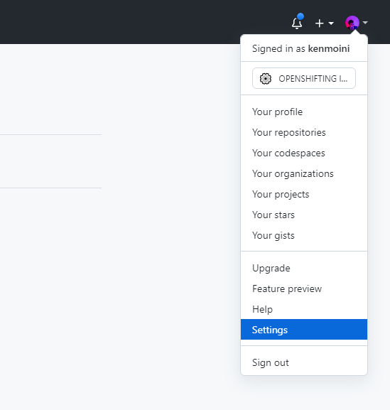
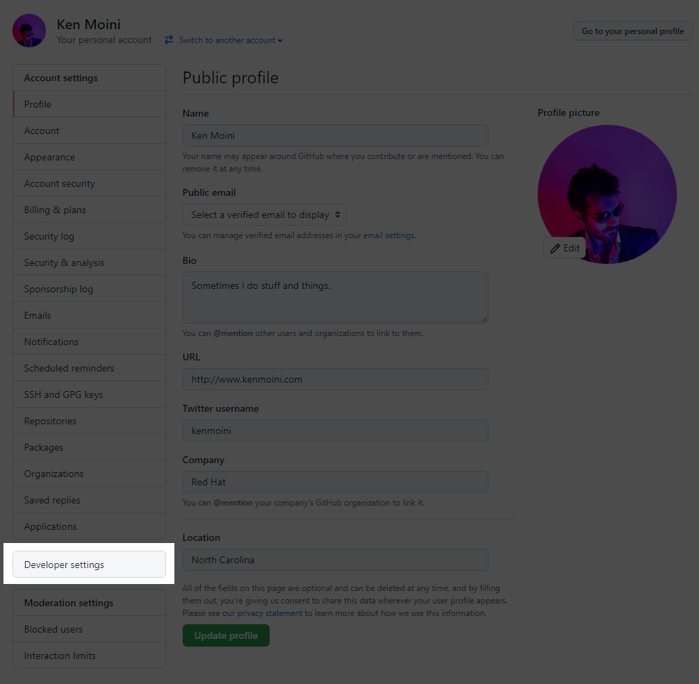
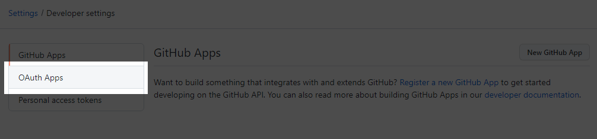
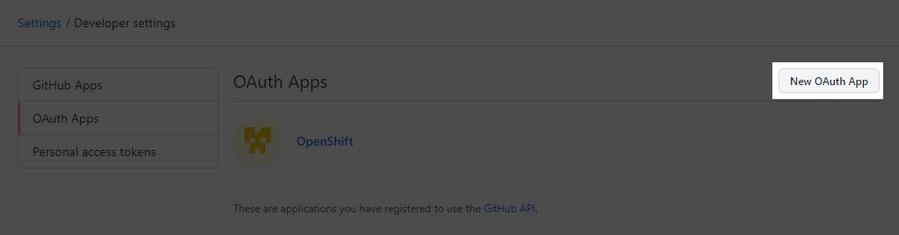
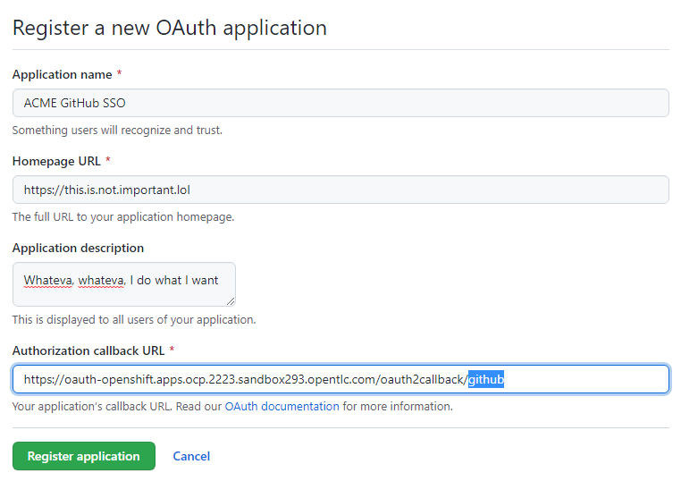
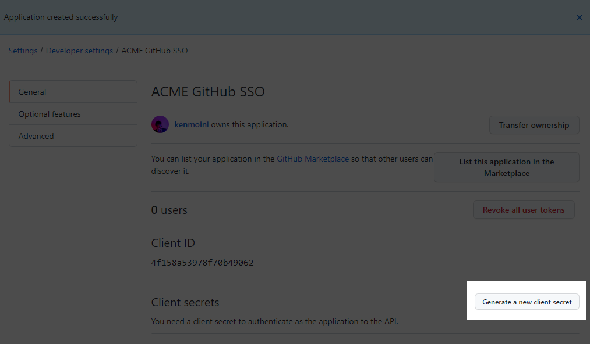
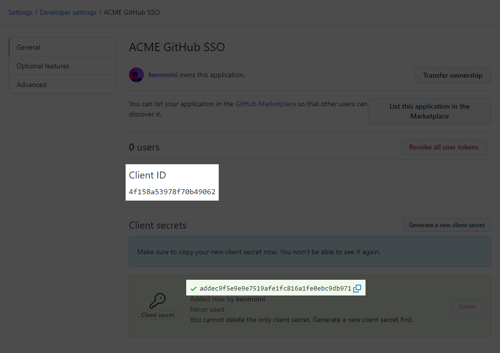

# GitHub OAuth Identity Provider for OpenShift

# Automation

*(Still needs the Manual Processes > Prerequisites to take place in GitHub)*

In this directory you can find a `./configure.sh` file that will allow you to quickly apply GitHub OAuth authentication to a logged in cluster.  ***Edit the file*** and run as follows:

```bash
# Export the client credential variables
export GITHUB_CREDENTIAL_CLIENT_ID="abc123"
export GITHUB_CREDENTIAL_CLIENT_SECRET="someLongSecretString"
# See `./configure.sh` for extra variables

# Check configuration
./configure.sh
# Actually apply configuration
./configure.sh --commit
```

Requires the GitHub OAuth Client Credentials to be passed as environmental variables.

# Manual Processes

## Prerequisites

Before you can configure OpenShift to use GitHub as an Identity Provider, you need to create the OAuth Client in GitHub.

### 1. Navigate to GitHub Settings

<div align="center" style="text-align:center">



**Goto your user's GitHub Settings**

</div>

### 2. Navigate to Developer Settings

<div align="center" style="text-align:center">



**Use the left-hand pane to navigate to Developer Settings**

</div>

### 3. Navigate to OAuth Apps

<div align="center" style="text-align:center">



**Use the left-hand pane to navigate to OAuth Apps**

</div>

### 4. Create a New OAuth App

<div align="center" style="text-align:center">



**Click 'New OAuth App'**

</div>

### 5. Provide Information

<div align="center" style="text-align:center">



**Provide the GitHub OAuth Application some primer information**

</div>

Provide the following information:

- **An Application Name**, whatever you'd like - this will show on the Authorization flow screen
- **A URL** - this isn't checked and doesn't really matter outside of metadata
- A **Description**, maybe
- The **Authorization Callback URL** is the most important part of this form - it'll be the OpenShift OAuth Callback endpoint, eg `https://oauth-openshift.apps.cluster-3078.3078.sandbox601.opentlc.com/oauth2callback/google` following the format of: `https://oauth-openshift.apps.<cluster_name>.<base_domain>/oauth2callback/<IdP_Name>`

Next, click **Register application**

### 6. Generate a new Client Secret

<div align="center" style="text-align:center">



**Click the 'Generate a new client secret' button**

</div>

With the OAuth Client Application registered, you are provided a Client ID - this is static and assigned to this application with the only way to change the Client ID is to create a new OAuth Application.

A Client Secret is still needed - click the **Generate a new client secret button**

### 7. Copy Client ID and Client Secret

<div align="center" style="text-align:center">



**Take note of the Client ID and Client Secret**

</div>

The Client ID and Client Secret are needed moving forward.  If this is a private instance of GitHub Enterprise, the CA Certificate PEM will also be needed.

## Adding the GitHub IdP to the OpenShift Cluster

With the configuration finished in GitHub, we can now add our OAuth information to the cluster for consumption.

### 1. Create OpenShift Secret for the OAuth Client Secret

Next, you can create the needed OpenShift Secret with the following command, so long as you are logged in as a cluster-admin

```bash
oc create secret generic github-oauth-client-secret --from-literal=clientSecret=$GITHUB_CREDENTIAL_CLIENT_SECRET -n openshift-config
```

### 2. [Optional] Create an OpenShift ConfigMap for the GitHub Enterprise CA Certificate

If you're connecting to a private GitHub Enterprise instance, OpenShift will need the CA Certificate chain to validate connections.  Provide that with the following command:

```bash
oc create configmap github-ca-config-map --from-file=ca.crt=$GITHUB_CA_CERT_PEM_FILE -n openshift-config
```

### 3. Create the YAML for the OAuth Custom Resource

With the Secret created, you can now reference it in the YAML definition of the OAuth provider:

https://docs.openshift.com/container-platform/4.8/authentication/identity_providers/configuring-github-identity-provider.html#identity-provider-github-CR_configuring-github-identity-provider

- Replace the ***CLIENT_ID_HERE*** text in the following YAML with whatever your Client ID is:

```yaml
apiVersion: config.openshift.io/v1
kind: OAuth
metadata:
  name: cluster
spec:
  identityProviders:
  - name: github
    mappingMethod: claim
    type: GitHub
    github:
      clientID: CLIENT_ID_HERE
      clientSecret:
        name: github-oauth-client-secret
```

***Notes:***

- The `.spec.identityProviders[0].name` is the same as the IdP Name prefixed to the end of the Authorized Redirect URI that was created in GitHub OAuth Application Client Registration earlier
- There are other options available to specify such as Organization and Team filters
- If this is a private GitHub Enterprise instance then you also need to define the `.spec.identityProviders[0].github.ca.name` parameter

### 4. Apply the YAML to the OpenShift Cluster

With the YAML created, we can apply it to the cluster now with the following command, assuming you saved it to a file called oauth.yaml:

> ***WARNING*** The following command may overwrite your current IdP settings!

```bash
oc patch OAuth cluster --patch-file oauth.yaml
```

### 5. ???????

### 6. PROFIT!!!!!1

Once the Authentication Operator has restarted you should be able to log into the cluster with GitHub Authentication!