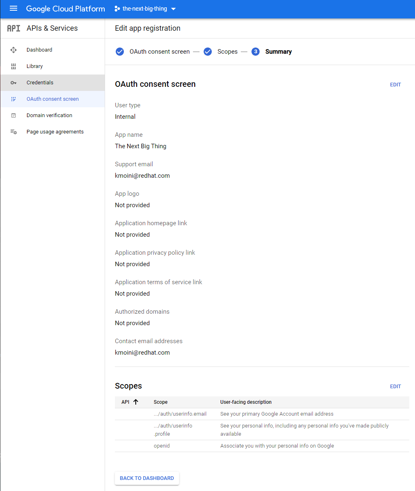

# Google OAuth Identity Provider for OpenShift

## Prerequisites

Before you can configure OpenShift to use Google as an Identity Provider, you need to create the Project > Credentials in Google Cloud.

## 1. Creating the Google Cloud Project

Everything in GCP is organized into Projects - create a new Project in an organization: 
https://console.cloud.google.com/cloud-resource-manager

<p align="center" style="text-align:center">


**Create a new Project**


**Give it a name**


**Enter the newly created Project**

</p>

---

## One-time Setup: Configure Consent Screen

In case this is a brand new Project and your first time setting up an OAuth Client ID, you’ll need to set a App/Product Name on the Consent Screen that is prompted to the user when authenticating.

Navigate to the Consent Screen section of the **APIs & Services > Credentials** section of GCP:
https://console.cloud.google.com/apis/credentials/consent

<center>


**Navigate to APIs & Services > Credentials > OAuth Consent Screen**

</center>

---

### Consent Screen User Type

Select whatever User Type you feel appropriate for your use case - the Internal type has the lowest barrier of use.

<center>


**Select User Type**

</center>

---

### Consent Screen Application Information

This next form will prompt for details around what is presented to the user when authenticating.

<center>


**Fill in some information**

</center>

---

### Provided Scopes

Scopes allow your application to retrieve information from the Google Identity Provider.

<center>


**Click Add or Remove Scopes**


**Select the required basic scopes, `/auth/userinfo.email`, `/auth/userinfo.profile`, and `openid`**

**Click Update**


**Click Save and Continue**

</center>

---

## 2. Creating the OAuth Client ID

With the Consent Screen configured, we can continue to create the OAuth Client ID that we'll use to configure the OpenShift cluster that will use this Google IDP.

<center>



**Navigate to APIs & Services > Credentials:** https://console.cloud.google.com/apis/credentials/oauthclient


**Click Create Credentials and select OAuth Client ID from the drop down**


**Provide the information needed to create an OAuth Client ID**

</center>

- For **Application Type**, select `Web application`
- Provide a **Name**
- For **Authorized JavaScript origins**, provide the OCP OAuth Application route, eg `https://oauth-openshift.apps.cluster-3078.3078.sandbox601.opentlc.com` following the format of `https://oauth-openshift.apps.<cluster_name>.<base_domain>`
- For **Authorized Redirect URIs**, provide the OAuth Callback endpoint, eg `https://oauth-openshift.apps.cluster-3078.3078.sandbox601.opentlc.com/oauth2callback/google` following the format of: `https://oauth-openshift.apps.<cluster_name>.<base_domain>/oauth2callback/<IdP_Name>`

*Note: The IdP Name prefixed to the end of the Redirect URI must match the IdP Name configured on the cluster, which will be done in the following steps - here we are simply naming it `google`*

Click **Create**

<center>


**Take note of the ID and Secret, feel free to download the JSON**

</center>

Once you have clicked Create in the previous step, you will be redirected to the Credentials page with a pop-up modal that will provide you with the OAuth Credentials and the ability to download it as a JSON file - do so.

## 3. Create OpenShift Secret for the OAuth Client Secret

Next, you can create the needed OpenShift Secret with the following command, so long as you are logged in as a cluster-admin, provided the downloaded JSON file from the previous step is located in the local directory (also requires the `jq` binary)

```bash
oc create secret generic google-oauth-client-secret --from-literal=clientSecret=$(jq -r '.web.client_secret' ./creds.json) -n openshift-config
```

## 4. Create the YAML for the OAuth Custom Resource

With the Secret created, you can now reference it in the YAML definition of the OAuth provider:

https://docs.openshift.com/container-platform/4.8/authentication/identity_providers/configuring-google-identity-provider.html#identity-provider-google-CR_configuring-google-identity-provider

1. Get the Client ID from the downloaded JSON file with the following command:

    `jq -r '.web.client_id' ./creds.json`

2. Replace the ***CLIENT_ID_HERE*** text in the following YAML with whatever your Client ID is:

```yaml
apiVersion: config.openshift.io/v1
kind: OAuth
metadata:
  name: cluster
spec:
  identityProviders:
  - name: google
    mappingMethod: claim
    type: Google
    google:
      clientID: CLIENT_ID_HERE
      clientSecret:
        name: google-oauth-client-secret
      hostedDomain: "redhat.com"
```

***Notes:***

- The `.spec.identityProviders[0].name` is the same as the IdP Name prefixed to the end of the Authorized Redirect URI that was created in Google Cloud earlier
- The `.spec.identityProviders[0].google.hostedDomain` can be changed to a wildcard [*] to allow other Google Auth users that are not part of the `@redhat.com` domain

## 5. Apply the YAML to the OpenShift Cluster

With the YAML created, we can apply it to the cluster now with the following command, assuming you saved it to a file called oauth.yaml:

> ***WARNING*** The following command may overwrite your current IdP settings!

```bash
oc patch OAuth cluster --patch-file oauth.yaml
```

## 6. ???????

## 7. PROFIT!!!!!1

Once the Authentication Operator has restarted you should be able to log into the cluster with Google Authentication!