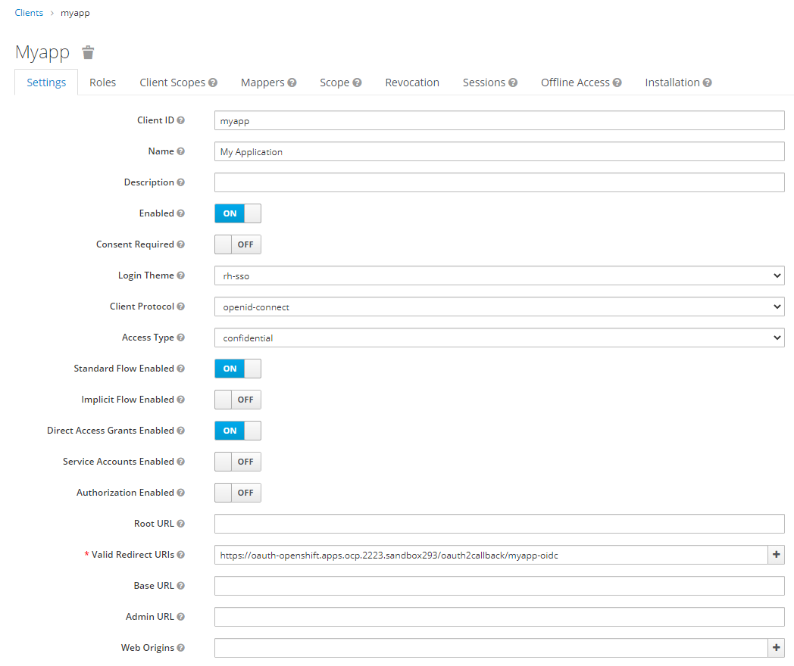

# OpenID Connect Identity Provider for OpenShift

# Automation

*(Still needs the Manual Processes > Prerequisites to take place in your OpenID Connect Auth server, like Red Hat SSO)*

In this directory you can find a `./configure.sh` file that will allow you to quickly apply OpenID Connect authentication to a logged in cluster.  ***Edit the file*** and run as follows:

```bash
# Check configuration
./configure.sh
# Actually apply configuration
./configure.sh --commit
```

Requires the OpenID Connect Keycloak OIDC Credentials JSON file to be present on the system and/or other variables defined as well.

# Manual Processes

## Prerequisites

Before you can configure OpenShift to use OpenID Connect as an Identity Provider, you need to create the Client Application in your OpenID Connect Auth server.  The following instructions will assume use of Red Hat SSO - you can find an easy/quick way to deploy Red Hat SSO to OpenShift here: https://github.com/kenmoini/rh-sso-demo

### 1. Create a new OpenID Connect Client

<div align="center" style="text-align:center">


**Click 'Create' to create a new OpenID Connect Client**

</div>

### 2. Provide Basic Details

<div align="center" style="text-align:center">


**Give the Client a Client ID, click Save**

</div>

### 3. Configure OIDC Client

<div align="center" style="text-align:center">



**Provide Client configuration information**

</div>

A few key things to note in general:

- For **Valid Redirect URIs**, provide the OpenShift OAuth Callback endpoint, eg `https://oauth-openshift.apps.cluster-3078.3078.sandbox601.opentlc.com/oauth2callback/myapp` following the format of: `https://oauth-openshift.apps.<cluster_name>.<base_domain>/oauth2callback/<IdP_Name>`

Some things to note for Red Hat SSO:

- Set the **Login Theme** to whatever you'd like
- **Access Type** should be set to `confidential`

Click **Save**

<div align="center" style="text-align:center">


**A freshly created RH SSO Client with the 'Credential' tab**

</div>

### 4. Download JSON and notable information

<div align="center" style="text-align:center">


**Client Secret can be found in the Credentials tab**

</div>

<div align="center" style="text-align:center">


**Download the Keycloak OIDC JSON file**

</div>

### 5. [Optional] Source OpenID Connect Server CA Certificate

If your OpenID Connect Server has a self-signed CA and/or Certificate not in the default system keystore then you'll need to get it and provide it to the OpenShift OAuth Cluster Configuration as a ConfigMap.  If running Red Hat SSO on OpenShift you can get the `router-ca` that secures the Application Routes with the following command:

```bash
oc get secret router-ca -n openshift-ingress-operator -o template='{{index .data "tls.key"}}' | base64 -d > $HOME/oidc-ca-cert.pem
```

## OpenShift Configuration

### 1. Create OpenShift Secret for the OpenID Connect Client Secret

Next, you can create the needed OpenShift Secret with the following command, so long as you are logged in as a cluster-admin, provided the downloaded Keycloak OpenID Connect JSON file is located in the `$HOME` directory:

```bash
oc create secret generic myapp-oidc-client-secret --from-literal=clientSecret=$(jq -r '.credentials.secret' $HOME/oidc-creds.json) -n openshift-config
```

### 2. [Optional] Create OpenShift ConfigMap for the OpenID Connect Auth Server CA Certificate

If you have a self-signed CA Certificate that needs to be provided to the OpenShift OAuth Configuration then you can create it with the following command, provided the PEM is located in the `$HOME` directory:

```bash
oc create configmap myapp-oidc-client-ca-cert --from-file=ca.crt=$HOME/oidc-ca-cert.pem -n openshift-config
```

### 3. Create the YAML for the OAuth Custom Resource

With the Secret{+ConfigMap} created, you can now reference it in the YAML definition of the OAuth provider:

1. Get the Client ID from the downloaded JSON file with the following command:

    `jq -r '.resource' $HOME/oidc-creds.json`

2. Replace the needed text in the following YAML with whatever your Client configuration is:

```yaml
apiVersion: config.openshift.io/v1
kind: OAuth
metadata:
  name: cluster
spec:
  identityProviders:
    - mappingMethod: claim
      name: myapp
      openID:
        ca:
          name: myapp-oidc-client-ca-cert
        claims:
          email:
            - email
          name:
            - name
          preferredUsername:
            - preferred_username
        clientID: CLIENT_ID_HERE
        clientSecret:
          name: myapp-oidc-client-secret
        extraScopes: []
        issuer: >-
          ISSUER_URI_HERE
```

***Notes:***

- Replace the ***CLIENT_ID_HERE*** and ***ISSUER_URI_HERE*** with your OpenID Connect Client information
  - For RH SSO, the Issuer URI would look something like this:
    `https://sso.example.com/auth/realms/REALM_NAME`
- The `.spec.identityProviders[0].name` is the same as the IdP Name prefixed to the end of the Valid Redirect URI that was created earlier

### 4. Apply the YAML to the OpenShift Cluster

With the YAML created, we can apply it to the cluster now with the following command, assuming you saved it to a file called oauth.yaml:

> ***WARNING*** The following command may overwrite your current IdP settings!

```bash
oc patch OAuth cluster --patch-file oauth.yaml
```

### 5. ???????

### 6. PROFIT!!!!!1

Once the Authentication Operator has restarted you should be able to log into the cluster with OpenID Connect Authentication!